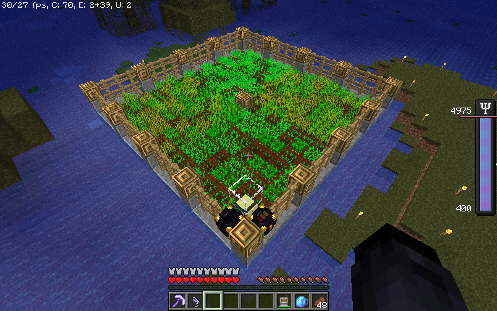

# Farmer tm
Simple farming script for computercraft turtles

## Features
- Will plant the same crop as was harvested from a position, allowing for rows or other patterns in your crops.
- [Configurable](#crops) for any 1 tall crop including modded crops
- Farm can be of any (rectangular) size.
- Turtle auto homes on startup from any position in your farm.
- Auto refuels & dumps inventory

### Crops
As mentioned above this can be configured to work with any 1 high crop. Below is a list of the already included crops:
- Vanilla:
  - basic crops: wheat, carrots, potatoes, beetroot
  - Melons / Pumpkins / (TODO: Cactus / Sugarcane)
    - I would use a specialized script & farm for these; but if you want to throw one into your farm so you get a little of it you can.
- Modded:
  - TODO


## Setup
This itself script is quite simple to use but it does require some specific farm setup.

### Turtle
As usual we can setup the script with pastebin:
```sh
pastebin get [PASTEBIN_ID] farmer.lua
```
Otherwise the turtle needs a pickaxe equiped.

### Farm
We have a list of requirements for how your farm is made below. Let the home position be any corner of your farm.

- The farm should be rectangular.
- The farm must be surrounded by 2 high walls (or just a 1 high wall on the same level as the turtle).
- The farm should be fully planted before starting the farmer.
- There should be a glass block above your home position (2 air blocks above the dirt of your farm)
- Facing the center of the farm standing at your home:
  - The right wall should be a chest to dump items into
  - The left wall should be a chest to retrieve fuel from
  - Both chests should be 1 air block above the dirt
- The turtle should be placed directly ontop of the crops, perferrably in the home position.

Example:


### Crops
Crops can be configured in the CROP_INFO global as follows:
```lua
-- information on the crops that might be in the farm
CROP_INFO = {
  ["minecraft:carrots"] = { ["max_growth"] = 7, ["seed_item"] = "minecraft:carrot" },
  ["minecraft:pumpkin"] = { ["max_growth"] = nil, ["seed_item"] = nil },
  ["minecraft:reeds"] = { ["max_growth"] = nil, ["seed_item"] = nil, ["max_height"] = 3},
  ...
}

```
- The key for a specific crop should be its planted block id. (`minecraft:carrots` (planted) vs `minecraft:carrot` (item))
- `max_growth` is the metadata value at which the crop is fully grown. If the crop does not have a growth value and should be harvested when it is seen set this to `nil`.
- `seed_item` is the item id of the item used to plant the crop. If the crop does not need to be replanted set this to `nil`.
- `max_height` is the height this crop grows to if it is not a 1 high crop. For example sugarcane (reeds) grows to 3 blocks tall normally.


## Compatability
This was made for CC v1.80pr1 and may not function properly in other versions as I have not checked.
